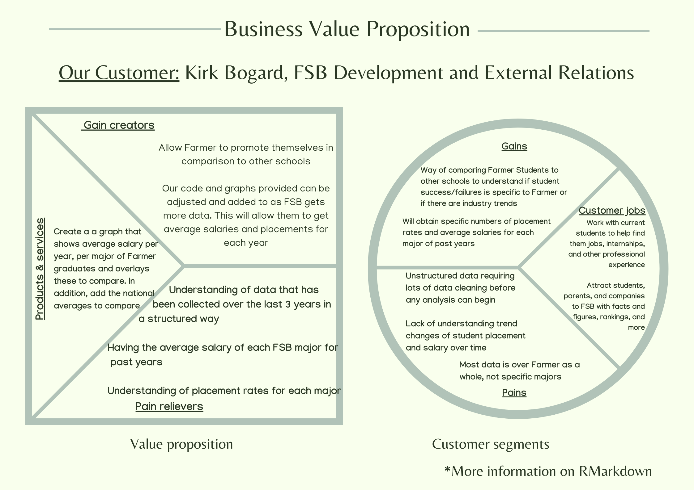

```{r setup, include=FALSE}
knitr::opts_chunk$set(echo = TRUE)
knitr::opts_chunk$set(fig.width=8, fig.height=6)
```

# Load Packages {.unnumbered}

```{r,echo=FALSE,warning=FALSE}
if(require(pacman)==FALSE) 
install.packages("pacman")## Loading package manager: pacman
pacman::p_load(readxl, gptstudio, httr, tidyverse, corrplot, DataExplorer,skimr, effects, dplyr)
```

# Business Value Proposition

## Visual



## Written

**1. Define the client or audience for your data analysis solution.**

Our client is the Office of the Dean & External Relations. More specifically we will be working with Kirk Bogard, Associate VP for Development and External Relations in FSB.

**2. Define the client jobs. What jobs are your clients trying to get done?**

Understand the performance of FSB based on job placement and salary.

Understand which majors tend to have more students obtain jobs

Attract students, parents, and companies to FSB with facts and figures, rankings, and more

Work with current students to help find them jobs, internships, and other professional experiences

**3. Add pains. What are the pains before, during, and after your customer is trying to get their jobs done? Create a bullet point for every specific pain**

Unstructured data requiring lots of data cleaning before any analysis can begin

Lack of understanding trend changes of student placement and salary over time

Lack of understanding with FSB majors are performing above/below the national average for salary

**4. Add gains. What are the gains that your customer expects to get or will be surprised to benefit from your solution?**

Way of comparing Farmer Students to other schools to understand if student success/failures is specific to Farmer or if there are industry trends

Will obtain specific numbers of placement rates and average salaries for each major of past years

**5. Describe your intended solution. Give a bullet point for each major element of your product or solution.**

Create a distribution for each specific major that shows salary distribution per year

Create a visual that overlays each majors salary distribution for each year to evaluate salary increase, decreases, etc

Compare these graphs with national averages from other schools to show FSB’s success (if FSB performs better than the national average)


**6. What are the painkillers from your solution? List out those things in your solution that can kill the pain points of your client.**

Obtaining the distributions for each major’s salries over the past years

Raw data will be cleaned

Visual that compares the distribution of each major by year


**7. What are the gain creators? List out the items that will add additional value to your customer, above and beyond addressing their current pain points.**

Our code and graphs provided can be adjusted and added to as FSB gets more data. This will allow them to get average salaries and placements for each year

The original data set will be cleaned for other data analysis projects. Future workers can use this data set to save time and run and create different analysis.

# Data Cleaning

## Importing Data

```{r}
data = readRDS(file = "FSB_BI_Survey_2019_2021.rds")
```

## Data Dictionary

The dataset contains three years of data representing FSB graduates, including graduates in 2019, 2020, and 2021. The dataset has 42 variables. The source is either derived during data cleaning/merging, from the Oracle Business Intelligence Enterprise Edition (OBIEE) maintained by Miami adminsitration, or from the self reported senior survey. The variables and their definitions are listed below.

**nmajor**: numeric,derived, the number of majors

**major1**: text, OBIEE, first major

**major 2**: text, OBIEE, second major

**BBRJ**: binary, OBIEE, an attribute of a student, but we do not know what this stands for

**Business Direct Admit**: binary, OBIEE, a direct admit to FSB as a first year

**Combined Cacc and Masters**: binary, OBIEE, combined degree student

**Dean's List**: binary, OBIEE, achieve dean's list status at least once

**First Generation College Stdnt**: binary, OBIEE, first generation student status

**FSB Scholars**: binary, OBIEE, FSB scholars program

**Honors Program**: binary, OBIEE, member of University honors program

**President's list**: binary, OBIEE, achieved president's list at least once

**Study Abroud Courtesy Account**: binary, OBIEE, do not know meaning

**Transfer Work**: binary, OBIEE, do not know exact meaning

**Cum Laude**: binary, OBIEE, graduated Cum Laude

**Magna Cum Laude**: binary, OBIEE, graduated Magna Cum Laude

**Summa Cum Laude**: binary, OBIEE, graduated Summa Cum Laude

**University Honors**: binary, OBIEE, graduated with University Honors

**University Honors w/Distinction**: binary, OBIEE, graduated with University Honors with Distinction

**minor1**: text, OBIEE, first listed minor

**minor2**: text, OBIEE, second listed minor

**IPEDS.Race.Ethnicity**: text, OBIEE, race/ethnicity

**Gender**: text, OBIEE, sex

**GPA.Range**: text, OBIEE, GPA within a .5 range

**Term.Code**: numberic, OBIEE, First four digits are the physcal year (beginning in July, e.g. July 2020 is FY 2021). Last two digits is the term (10=fall, 15=winter, 20=spring, 30=summer)

**Year.x**: text, derived, first four digits of Term.Code stored as a character variable

**latin_honors**: text, survey, latin honors designation

**survey_city**: text, survey, student reported city in which their job is located

**survey_company**: text, survey, student reported company in which they accepted a job

**survey_deptfunc**: text, survey, student reported job function

**survey_gradprogram**: text, survey, student reported graduate program they will be attending

**survey_gradschool**: text, survey, stuent reported graduate school they will be attending

**survey_internfour**: text, survey, student reported fourth internship they held during college

**survey_internthree**: text, survey, student reported third internship they held during college

**survey_interntwo**: text, survey, student reported second internship they held during college

**survey_internone**: text, survey, student reported first internship they held during college

**Survey_internships**: text, survey, Student reported number of internships they held during college

**survey_offers**: text, survey, student reported number of offers for full time employment received

**survey_plans**: text, survey, student reported plans after graduation

**survey_pref_field**: text, survey, student reported whether working in preferred field

**survey_pref_loc**: text, survey, student reported whether working in preferred location

**survey_salary**: numeric, survey, student reported salary

**survey_state**: text, survey, student reported state in which job is located

## Data Profile

```{r}
skim(data)
```

## Selection of Relevant Variables

Based on our BVP, not all variables within the data will be used. The following variables we plan on using to evaluate salary major are: **major1, major2, survey_plans, Gender, IPEDS.Race.Ethnicity, Year.x,** and **survey_salary.**

Below is more information on each of these variables. Something to note is for **survey_company**, we found the top 20 companies based on the frequency of responses. We will use this companies to analyze whether a company offers similar salaries regardless of majors.

### Selected Variables Levels
```{r}
levels(data$major1)
levels(data$major2)
table(data$year.x)
table(data$survey_plans)
table(data$Gender)
table(data$IPEDS.Race.Ethnicity)
```

## Top Companies

We first wanted to find the companies that hire the most students from Farmer. We capitalized all letters so we did not have to worry about case sensitivity while searching for frequencies. We wanted to find the companies with the highest frequencies in order to compare the salaries of each major.

```{r}
data$survey_company = toupper(data$survey_company)

top20companies = as.data.frame(table(data$survey_company))
top20sorted = top20companies[order(-top20companies$Freq), ]
head(top20sorted, 20)
```

We then cleaned the top companies to ensure all responses were counted for. We created new data frames for the top companies starting with their first letter to make the process quicker for finding inconsistencies.

### Deloitte
```{r}
data_d <- data[grep('^D', data$survey_company), ]

table(data_d$survey_company)

deloitte_mapping = c("DELOITTE CONSULTING" = "DELOITTE",
                     "DELOITTE." = "DELOITTE",
                     "DELOITTE, CHINA" = "DELOITTE",
                     "DELOITTE LLP" = "DELOITTE",
                     "DELOITTE TAX" = "DELOITTE")
```

### DHL
```{r}
dhl_mapping = c("DHL SUPPLY CHAIN" = "DHL")
```

### EY
```{r}
data_e <- data[grep('^E', data$survey_company), ]

table(data_e$survey_company)


ey_mapping = c("EY" = "EY", 
                  "E&Y" = "EY",
                  "ERNST & YOUNG" = "EY",
                  "E AND Y" = "EY",
               "EY (EY)" = "EY",
               "ERNST AND YOUNG" = "EY")
```

###KPMG
```{r}
data_k <- data[grep('^K', data$survey_company), ]

table(data_k$survey_company)

kpmg_mapping = c("KLYNVELD PEAT MARWICK GOERDELER" = "KPMG")
```

###PWC
```{r}

data_p <- data[grep('^P', data$survey_company), ]

table(data_p$survey_company)

pwc_mapping = c("PRICEWATERHOUSECOOPERS" = "PWC", 
                "PRICEWATERHOUSECOOPERS LLP" = "PWC", 
                "PWC LLP" = "PWC")
```

```{r}
data$survey_company <- str_replace_all(data$survey_company, ey_mapping)

data$survey_company <- str_replace_all(data$survey_company, deloitte_mapping)

data$survey_company <- str_replace_all(data$survey_company, kpmg_mapping)

data$survey_company <- str_replace_all(data$survey_company, pwc_mapping)

data$survey_company <- str_replace_all(data$survey_company, dhl_mapping)

#data$survey_company <- str_replace_all(data$survey_company, pwc_mapping)
```

```{r}
top20companies = as.data.frame(table(data$survey_company))
top20sorted = top20companies[order(-top20companies$Freq), ]
head(top20sorted, 20)
```

```{r}
data
```

## Mean Imputation
We imputed the average salary for each major for all responses with a missing salary response.

```{r}
imputed_data = data %>% 
  group_by(major1) %>% 
  dplyr::mutate(survey_salary=ifelse(is.na(survey_salary), mean(survey_salary, na.rm = TRUE), survey_salary)) %>% 
  ungroup()
```

## Removing Observations

We only kept observations for students who said they have accepted a full-time or part-time job, ignoring observations for students continuing education, joing the military, etc. as it is not the focus of our analysis.

```{r}
filtered_data <- imputed_data %>%
  filter(survey_plans %in% c("accepted fulltime job", "accepted parttime job"))
head(filtered_data)
```

#Closing Session

```{r}
sessionInfo()
```
>>>>>>> ab04349be00d049c01477c12f80955fb52724ccf
